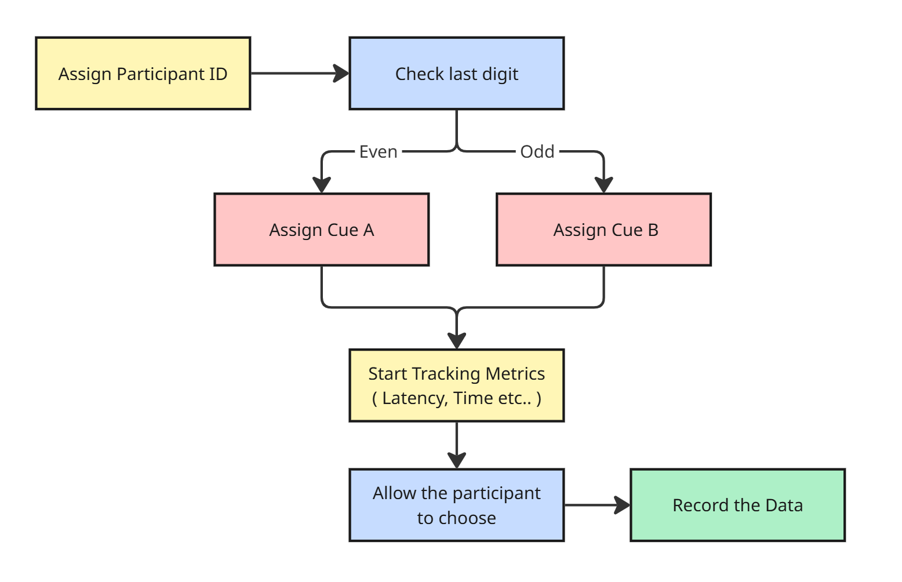

# HumanAI Screening Task ISSR 3

A modular experimentation engine prototype for studying trust calibration in AI-assisted decision systems.

## Overview
This project consists of a minimal React frontend and a FastAPI backend designed to deliver an AI recommendation task, log participant behavior, and record latencies.

## System Architecture Flowchart



## Condition Logic
The application automatically determines the experimental condition based on the participant's ID (`pid`) given in the URL string:
- **Condition A (Even PID last digit):** The agent cue is named "System AI", employs a formal tone, and expresses recommendations with a statistical confidence score.
- **Condition B (Odd PID last digit):** The agent cue is assigned a human name ("Alex"), employs a conversational/social tone, and frames the recommendation based on prior activity.

This current implementation of recommendation is hardcoded written to simulate the experiment. In actual implementation, it would be connected to an actual AI system. 

## Logging Implementation
Behavioral data is logged with high temporal resolution using `performance.now()` in the React frontend. Logs are sent via a POST request to the FastAPI backend, which sequentially writes the event schema into local `logs.json` and `logs.csv` files.

**Exported Schema:**
- `participant_id`: String (e.g., "123")
- `condition`: String ("A" or "B")
- `decision`: String (e.g., "A", "B" - the ID of the chosen item)
- `timestamp`: ISO-8601 String
- `latency_ms`: Float (response time in milliseconds)

## How to Run Locally

### 1. Backend (FastAPI)
Navigate to the `backend` directory, install requirements, and run the server:
```bash
cd backend
pip install -r requirements.txt
uvicorn main:app --reload
```
The server will run on `http://localhost:8000`.

### 2. Frontend (Static HTML/JS)
Navigate to the `frontend` directory and simply expose the files using any static local web server:
```bash
cd frontend
python -m http.server 8080 --bind 127.0.0.1
```
Open `http://localhost:8080` to test the task. A unique `pid` will be generated if not provided in the URL string context.

## Sample Output File
**logs.csv :**
```csv
participant_id,condition,decision,timestamp,latency_ms
69610649,B,A,2026-03-27T14:04:01.224Z,1976.4000000059605
75231897,B,A,2026-03-27T14:04:13.223Z,1396.2999999970198
```
**logs.json :**
```json
[
    {
        "participant_id": "69610649",
        "condition": "B",
        "decision": "A",
        "timestamp": "2026-03-27T14:04:01.224Z",
        "latency_ms": 1976.4000000059605
    },
    {
        "participant_id": "75231897",
        "condition": "B",
        "decision": "A",
        "timestamp": "2026-03-27T14:04:13.223Z",
        "latency_ms": 1396.2999999970198
    },
]
```

## Future Scope (Extension to the Task)
- **Dynamic AI Generation:** Use LLMs to generate actual context-aware AI recommendations instead of templated cues.
- **Trust Calibration Matrix:** Introduce variable yet experimentally controlled system accuracy across different scenarios to measure calibration thresholds.
- **A/B Testing Simulation:** Test the system proactively by deploying synthetic user agents or conducting pilot mock surveys before full deployments.
- **Advanced Control Measures:** Implement counterbalancing for order effects in multi-task scenarios and introduce manipulation checks (self-report + behavioral data).
- **Adaptive Algorithms:** Test reinforcement learning techniques (e.g., Multi-Armed Bandit) on top of traditional A/B testing for post-trust calibration analysis, optimizing personalized behavioral cues seamlessly over time.
