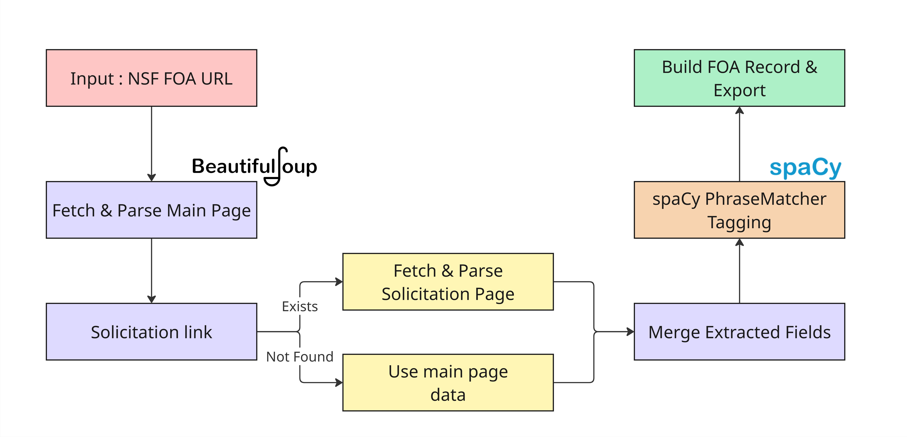

# FOA Ingestion + Semantic Tagging Pipeline

Ingests an **NSF Funding Opportunity Announcement (FOA)** from a public URL, extracts structured fields using a layered extraction strategy, applies **spaCy-powered rule-based semantic tags**, and exports the result as **JSON** and **CSV**.

---

## Quick Start

```bash
pip install -r requirements.txt
python -m spacy download en_core_web_sm  # optional, blank model used by default

python main.py \
  --url "https://www.nsf.gov/funding/opportunities/nqni-national-quantum-nanotechnology-infrastructure" \
  --out_dir ./out
```

| Output | Description |
|--------|-------------|
| `out/foa.json` | Full FOA record with semantic tags (nested JSON) |
| `out/foa.csv` | Flat row with pipe-separated tag columns |

---

## Pipeline Flowchart




## Full-Text Extraction Strategy

Instead of relying on brittle HTML structure mappings, the pipeline uses a simplified generic approach:
- Extract all visible text into a single string using `soup.get_text(" ", strip=True)`
- Scan the string for target headers/keywords using `extract_window(text, keywords)`
- Return an approximate window (e.g., 1500 chars) around the first match to capture the target context.
- Use compiled Regex patterns on this full-text output to directly extract dates, FOA IDs, and award amounts without assuming DOM proximity.

---

| Field | Type | Source |
|-------|------|--------|
| `foa_id` | `str` | Solicitation ID (e.g. `NSF 26-505`); extracted directly using Regex |
| `title` | `str` | `<h1>` on the main page |
| `agency` | `str` | Always `"NSF"` |
| `open_date` | `str \| null` | Posted date evaluated from full text using keyword matching |
| `close_date` | `dict \| null` | Dictionary of `{deadline_label: ISO_date}` captured dynamically from surrounding text |
| `eligibility` | `str` | Surrounding text chunk from fallback 'eligibility' keywords |
| `program_description` | `str` | Synopsis text chunk via keyword extraction |
| `award_range` | `str \| null` | Dollar range extracted directly from full text via generic Regex |
| `source_url` | `str` | The original input URL |
| `solicitation_url` | `str \| null` | Link matching 'solicitation' via simple anchor scan |
| `source_type` | `str` | Detected source type, e.g. `"nsf_html"` |
| `source_format` | `str` | Format of the source, e.g. `"html"` |
| `semantic_tags` | `object` | Rule-based ontology tags (see below) |

---

## Semantic Tagging (spaCy PhraseMatcher)

Tags are applied using **spaCy's `PhraseMatcher`** which matches ontology keywords at token boundaries for more accurate matching than simple substring search.

The ontology covers four categories:

- **Research Domains** — Quantum, Nano, AI, Semiconductors, Biotech, Materials Science, etc.
- **Methods / Approaches** — Fabrication, Characterization, Simulation, User Facility, etc.
- **Populations** — Undergrad, Graduate, Postdoc, Faculty, K-12, Industry, etc.
- **Sponsor Themes** — Workforce Development, Broadening Participation, Infrastructure, etc.

---

## Source Metadata

Each FOA record includes metadata about how it was ingested:

```json
{
  "source_type": "nsf_html",
  "source_format": "html"
}
```

This enables downstream systems to handle different source types and formats appropriately.

---

## Architecture

```
Screening_Task/
├── main.py             # Single-file minimal pipeline
├── requirements.txt    # Python dependencies
├── README.md           # This file
└── out/
    ├── foa.json        # Extracted FOA record
    └── foa.csv         # Flat CSV export
```

**Key design decisions:**
- **DOM independence** — Minimal HTML coupling, relying directly on raw text content parsing
- **Full Text Windows** — Generic window-based extraction provides resilient contextual snapshots for any schema requirements
- **Regex Power Extraction** — Identifiers and numerical boundaries extracted efficiently using optimized Regex over entire text
- **spaCy matching** — Token-boundary-aware matching instead of naive substring search

---

## Future Improvements

The current implementation uses rule-based keyword matching via spaCy's PhraseMatcher as a baseline. Web parsing can be improved using LLMs to extract structured information via pydantic models. 

The tagging system can be extended using semantic methods such as:

- **Embedding-based semantic similarity** using huggingface models
- **Vector search** for FOA similarity using FAISS
- **LLM-assisted classification** to assign ontology tags from program descriptions

In this approach, FOA text is converted into dense embeddings, which can be compared with ontology term embeddings using cosine similarity to detect semantic relationships beyond exact keyword matches.

This enables more flexible **semantic search** and **funding opportunity discovery** across large FOA datasets.

---

## Requirements

- Python 3.10+
- `requests`, `beautifulsoup4`, `pydantic`, `spacy`
